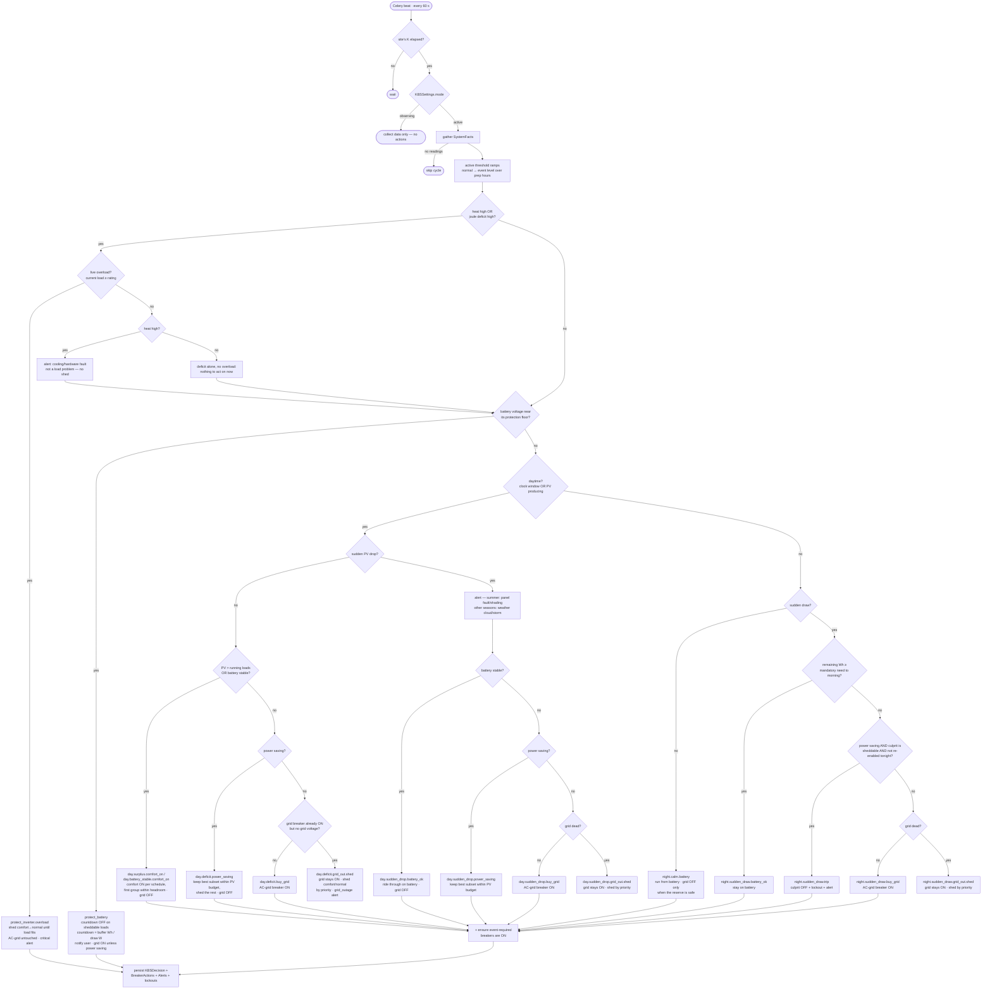

# SmartBreaker — Knowledge-Based System Engine

Documentation of the main (server-side) KBS engine as implemented so far.
It covers the data model, the engine pipeline, the full decision tree, the
plug-in points, and what is intentionally left for later phases.

---

## 1. Overview

The KBS balances a solar site's energy by controlling smart breakers. Every
**K seconds** (`KBSSettings.cycle_seconds`, per site) it takes one snapshot of
the whole site — inverter telemetry, breaker states, scheduled events, weather
— walks a decision tree, and emits **the new state each breaker must be
switched to**, plus alerts for the user.

Its goals, in priority order:

1. **Protect the inverter** (heat / cumulative energy deficit → emergency shedding).
2. **Never switch off mandatory loads** (servers, …) and guarantee they survive
   the night on battery (the *night reserve*).
3. **Maximize solar usage / minimize grid purchases**, honoring the user's
   power-saving preference and per-breaker priorities.

The system is two-tier:

| Tier | Where | Cadence | Scope | Status |
|---|---|---|---|---|
| Tier-1 safety KBS | Raspberry Pi (LAN, next to the inverter) | ~1 s | overheat, overload, battery floor, grid outage | **implemented** — `edge/tier1_kbs.py` (§11) |
| Tier-2 main KBS | Django server (Celery) | minutes (K) | full decision tree, scheduled events, weather, learning | **implemented** — `apps/kbs/` |

---

## 2. What was built

```
apps/breakers/                       extended
├── models.py        Breaker (KBS metadata) + BreakerStatus (live state) + BreakerReading (time series)
├── serializers.py   status-ingest serializer (edge → server) + Breaker config serializer
├── views.py         POST /api/breakers/status/  (single or batch)
└── migrations/0002  data-preserving renames + new models

apps/kbs/                            new app
├── models.py        KBSSettings, ScheduledEvent, KBSDecision, BreakerAction, Alert
├── engine/
│   ├── facts.py     DB + clock + unit conversion → one SystemFacts snapshot
│   ├── derived.py   pure math: joule deficit, baselines, sudden drop/draw, season, day/night
│   ├── rules.py     the decision tree — pure function decide(facts) → RuleResult
│   ├── grouping.py  PLUG-IN: staggered turn-on groups / best-subset selection
│   ├── weather.py   PLUG-IN: weather API (season works already; condition/sunrise TODO)
│   └── actions.py   run_cycle(): gather → decide → persist decision/actions/alerts/lockouts
├── tasks.py         Celery beat dispatcher (every 60 s) + per-site cycle task
└── tests.py         16 unit tests — one per decision branch, DB-free
```

Design rule: **`rules.py` is pure.** All database access, clock reads and unit
conversions happen in `facts.py`; the decision logic is a function of a frozen
snapshot, so every flowchart branch is unit-testable with fabricated facts.

Code style rule (project-wide): every variable/field carries an inline comment
with its **meaning and unit**. Breaker hardware reports milli-units (mA / mW /
mV); the inverter reports base units (V / A / W); the engine computes in W, Wh,
J. Conversion happens once, in `facts.py`.

---

## 3. Data model

### 3.1 `Breaker` (per-breaker KBS metadata, user-configured)

| Field | Meaning | Unit |
|---|---|---|
| `priority_type` | importance category: `mandatory` > `normal` > `comfort`; plus special `ac_grid` | choice |
| `priority_degree` | importance **inside** the category; higher = more important | positive int |
| `load_type` | `motor` (inrush profile) or `normal` (flat profile) | choice |
| `peak_load_W` | highest sustained draw — learned in the observing phase | W |
| `mean_load_W` | steady-state average draw — learned in the observing phase | W |
| `cycle_start` / `cycle_end` | daily **usage window**, set by the user through the app: when this load is normally used (e.g. not at night). Comfort loads turn ON inside it; loads outside their window are preferred shedding candidates. The raw `cycle_time` string reported by the device is stored but ignored — the DB fields are the source of truth. | local clock time |
| `locked_out` / `lockout_reason` / `locked_at` | KBS trip that only the user may undo | flag / text / UTC |

Category semantics:

- **mandatory** — the KBS never switches these off. Ever.
- **normal** — may be shed when the system is stressed.
- **comfort** — luxury loads: first to shed, last to restore, scheduled via `cycle_start`/`cycle_end`.
- **ac_grid** — the one special breaker that connects the site to state-grid
  electricity. *"Buy grid electricity" = switch this breaker ON.*

Shedding always walks: comfort (lowest degree first) → normal (lowest degree
first) → **stop**. Restoring walks the reverse.

**motor loads** (AC units, pumps): draw `peak_load_W` for the first
`motor_peak_minutes` (~20 min) after switch-on, then settle to `mean_load_W`.
All head-room math uses the peak for a load that is (or would be) freshly
switched on, and the mean for one that has settled.

### 3.2 `BreakerStatus` (live state, one row per breaker, overwritten on report)

Mirrors the device parameters: `switch`, `countdown_1_s`, `cur_current_mA`,
`cur_power_mW`, `cur_voltage_mV`, `fault`, `relay_status`
(`power_off`/`power_on`/`last`), `child_lock`, `cycle_time`, `online`, plus
`last_switched_on_at` (stamped on every OFF→ON transition — this is how the
engine knows whether a motor load is still in its peak phase).

`child_lock` is a device-side safety toggle for the physical buttons; the KBS
stores it but deliberately ignores it — remote control keeps working.

### 3.3 `BreakerReading` (per-breaker time series)

`(breaker, timestamp, switch, cur_power_mW)` — feeds the observing-phase
learning and the night sudden-draw **culprit detection**.

### 3.4 `KBSSettings` (per site — one Organization = one physical site)

| Field | Meaning | Default |
|---|---|---|
| `mode` | `observing` (first ~3 days: learn only, no actions) / `active` | `observing` |
| `data_source` | `real` (data from the client's Pi, cycles on the server clock) / `simulator` (cycles anchor to the latest reading's **simulated** timestamp, so simulated time drives day/night, windows and events) | `real` |
| `power_saving` | user flag: prefer shedding/subsets over buying grid power | off |
| `cycle_seconds` | **K** — period between decision cycles | 300 s |
| `battery_capacity_Wh` | usable battery energy at 100 % | 5000 Wh |
| `night_reserve_percent` | battery share reserved for mandatory loads overnight (learned) | 30 % |
| `stability_threshold_percent` | battery % counted as "stable" on a normal day | 50 % |
| `event_stability_threshold_percent` | threshold reached by the time an event starts (ramped, see §4.4) | 80 % |
| `battery_low_voltage_V` | voltage floor the bank must never reach — set per battery chemistry/site | 24.0 V |
| `battery_low_margin_V` | act this far above the floor (`voltage ≤ floor + margin` triggers battery protection) | 0.5 V |
| `battery_shutdown_buffer_percent` | energy the site may still spend after the trigger before countdowns flip breakers OFF | 2 % |
| `grid_present_min_V` | grid voltage at/above which the state grid counts as actually delivering | 100 V |
| `heatsink_temp_limit_C` | inverter protection trigger | 70 °C |
| `joule_deficit_limit_J` | cumulative (load − PV) energy trigger — sized so normal night battery usage does **not** trip it | 10.8 MJ (= 3 kWh) |
| `deficit_window_minutes` | look-back window for the joule deficit | 30 min |
| `max_inverter_power_W` | maximum continuous AC output the inverter tolerates | 5000 W |
| `sudden_drop_fraction` | PV drop vs. baseline that counts as sudden | 0.4 |
| `sudden_draw_W` | load jump vs. baseline that counts as a night sudden draw | 1000 W |
| `baseline_minutes` | look-back window for PV/load baselines | 10 min |
| `motor_peak_minutes` | motor inrush duration | 20 min |
| `event_prep_hours` | length of the pre-event ramp: the threshold rises linearly from normal to event level over these hours | 24 h |
| `day_start` / `day_end` | daytime window fallback until the weather API supplies sunrise/sunset | 06:00 / 18:00 |
| `pv_day_min_W` | PV production that proves daylight regardless of the clock window | 10 W |

### 3.5 Engine output models

- **`KBSDecision`** — one row per cycle: the branch code taken + a full JSON
  snapshot of the `SystemFacts` it was based on (audit trail).
- **`BreakerAction`** — the actual output: `(breaker, 'on'|'off', countdown_s,
  reason, executed)` — the new state the breakers must be switched to.
  `countdown_s = 0` means switch immediately; `> 0` means arm the device
  countdown so the switch happens after that delay (used by battery
  protection). The edge (Pi) picks these up, executes, and ACKs via `executed`.
- **`ScheduledEvent`** — user-announced event with `start_at`/`end_at` and
  `required_breakers` (M2M): breakers the user needs ON for the whole event
  window.
- **`Alert`** — user notifications: `weather_drop`, `panel_fault`,
  `inverter_protection`, `battery_low`, `breaker_fault`, `night_trip` with
  severities `info`/`warning`/`critical`.

---

## 4. The decision cycle

### 4.1 Pipeline

```
Celery beat (60 s) ─→ run_kbs_cycles (dispatcher)
                        └─ for each active site whose K elapsed:
                             run_kbs_cycle_for_org
                               └─ run_cycle(org)
                                    ├─ gather_facts(org, settings)   facts.py   (DB, clock, units)
                                    ├─ decide(facts)                 rules.py   (pure)
                                    └─ _persist(...)                 actions.py (decision + actions + alerts + lockouts)
```

`mode='observing'` → the cycle stops before deciding: telemetry keeps being
collected for learning, but no actions are taken.

### 4.2 Derived signals (computed in `facts.py` / `derived.py`)

| Signal | How it is derived |
|---|---|
| PV production `pv_power_W` | inverter `pv_charging_power_W`, falling back to `pv_input_voltage_V × pv_input_current_A` |
| joule deficit | trapezoid integral of `max(load_W − pv_W, 0)` over `deficit_window_minutes` — surplus moments do **not** cancel deficit (J) |
| sudden PV drop | current PV ≤ baseline × (1 − `sudden_drop_fraction`), baseline = mean over `baseline_minutes` excluding the newest sample; baselines under 100 W are noise |
| sudden draw | current load − load baseline ≥ `sudden_draw_W` |
| draw culprit | the breaker whose newest `BreakerReading` rose the most above its own earlier average inside the window |
| battery stable | `battery_capacity_percent ≥` the **active** threshold: ramps linearly from the normal to the event level over the `event_prep_hours` before a scheduled event (`ramped_threshold`) |
| battery low | `battery_voltage_V ≤ battery_low_voltage_V + battery_low_margin_V` **and not charging** (charge current ≤ 0.5 A) — a charging bank recovers on its own |
| grid failed | AC-grid breaker ON **and** `grid_voltage_V < grid_present_min_V` — the breaker is closed but the state grid is out |
| battery draw | `battery_voltage_V × battery_discharge_current_A`, falling back to `max(load − PV, 0)` (W) |
| graceful countdown | `battery_buffer_Wh / battery_draw_W × 3600`, clamped to [60 s, 3600 s] — how long breakers may stay ON before their scheduled switch-off (`graceful_countdown_s`) |
| night reserve check | `battery_remaining_Wh ≥ Σ ((mandatory + event-required) expected draw × hours_to_morning)` |
| headroom | `max_inverter_power_W − current load` (W) |
| day / night | clock window (weather-API sunrise/sunset, else `day_start`/`day_end`) **OR** PV production ≥ `pv_day_min_W` — a storm zeroing PV during the clock-day stays "day"; pre-dawn production counts as day |
| season | month + hemisphere (from `Organization.latitude`) |

### 4.3 The decision tree



Every cycle takes **exactly one branch**; the branch code is stored on the
`KBSDecision` row, so the history of the system's reasoning is queryable.

### 4.4 Behaviors worth knowing (beyond the chart)

- **Battery countdown shutdown.** When the bank voltage comes within
  `battery_low_margin_V` of its floor, the engine does not cut loads
  instantly: it arms each sheddable breaker's **device countdown** so the
  switch-off happens after the site has spent at most
  `battery_shutdown_buffer_percent` of capacity (countdown = buffer Wh ÷
  current draw W, clamped 60 s–1 h), and raises a critical `battery_low`
  alert telling the user exactly which breakers will switch off and when.
  Example: 2 % of a 5000 Wh bank = 100 Wh buffer at a 1200 W draw → 300 s.
  Unless power saving is on, the AC-grid breaker also goes ON immediately so
  the grid takes over.
- **Event preparation ramp.** Starting `event_prep_hours` (default 24 h)
  before a scheduled event, the stability threshold rises **linearly** from
  the normal to the event level — the system hoards battery charge gradually
  through the day and night before the event instead of jumping the target.
- **Event-required breakers are mandatory for the event window.** The
  breakers attached to a running event are excluded from every shedding list
  (including emergency shedding), counted into the power-saving budget and
  the night reserve, and switched ON (within head-room) if anything turned
  them off before the event began.
- **Usage windows steer shedding.** Among equally-ranked loads, ones outside
  their user-configured usage window (`cycle_start`/`cycle_end`) are shed
  first — the user is not using them right now anyway.
- **Staggered group turn-on.** When several comfort breakers are due, the
  engine only switches on the *first group* that fits the current inverter
  head-room (motor loads counted at `peak_load_W`). The rest follow on later
  cycles once earlier motors settle to `mean_load_W` and free head-room —
  producing the gradual, ~cycle-spaced start automatically.
- **Night-trip memory.** A breaker tripped at night is `locked_out`: the KBS
  will not switch it back on; only the user can. If the user *does* re-enable
  it, the trip is remembered for 12 h (`TRIP_MEMORY_HOURS`) — the engine will
  not trip the same breaker again that night, and instead buys grid power.
  This mirrors the flowchart's *trip → user re-enables → buy grid* loop.
- **Mandatory is untouchable.** No branch can emit OFF for a mandatory
  breaker — shedding candidate lists are built from comfort/normal only, and
  in power-saving budgeting the mandatory draw is subtracted from the budget
  *before* the auction between the other loads.
- **The AC-grid breaker is never touched during inverter protection.** It is
  the inverter's own AC input, not a separate supply line to the loads —
  every watt bought from the grid still passes through the same
  overloaded/overheated unit. Switching it on during `protect_inverter.overload`
  would add current, not remove it, so the only real fix is shedding until the
  load fits the rating; a heatsink over its limit without a live overload gets
  an alert instead (likely a cooling/hardware fault, which shedding can't fix).
  Grid purchases stay a day/night-branch decision, made once the inverter
  itself is no longer stressed.
- **Unhealthy breakers.** A breaker that is offline or reports a `fault` is
  never commanded ON; a `breaker_fault` alert is raised instead (critical if
  it's the AC-grid breaker being needed).

---

## 5. Plug-in points

| Where | What plugs in | Contract |
|---|---|---|
| `engine/grouping.py` | **The owners' grouping algorithm** (staggered group turn-on / optimal subset). Currently naive greedy fallbacks marked `TODO(user-algorithm)`. | `first_group_within_headroom(candidates, headroom_W, motor_peak_minutes) → [BreakerFacts]` and `select_best_subset(candidates, budget_W, motor_peak_minutes) → [BreakerFacts]` |
| `engine/weather.py` | **The external weather API** (condition + sunrise/sunset). Season already works locally (date + hemisphere). Marked `TODO(weather-api)`. | `get_weather_context(latitude_deg, longitude_deg, local_now) → WeatherContext(season, condition, sunrise, sunset)` |

---

## 6. API surface added

| Endpoint | Consumer | Purpose |
|---|---|---|
| `POST /api/breakers/status/` | Pi / simulator | push live breaker state (single or batch); updates `BreakerStatus`, appends `BreakerReading`, stamps `last_switched_on_at` on OFF→ON |
| `POST /api/telemetry/readings/` | Pi / simulator | push inverter readings |
| `POST /api/kbs/sim/run-cycle/` | simulator | trigger one decision cycle now (lets the simulator drive the K-cadence without Celery) |
| `GET /api/kbs/sim/state/` | simulator / Pi | settings + latest decision + **pending `BreakerAction`s** + recent alerts in one call |
| `POST /api/kbs/sim/ack/` | simulator / Pi | mark applied actions `executed=True` |
| `PATCH /api/kbs/settings/` | simulator / app | change `cycle_seconds` (K), `mode`, `power_saving`, `data_source` |

Both are currently `AllowAny`, matching the existing telemetry style —
**device-token auth is required before real deployment.**

---

## 7. Scheduling

`CELERY_BEAT_SCHEDULE` (in `config/settings/base.py`) fires
`apps.kbs.tasks.run_kbs_cycles` every 60 s. That dispatcher compares each
active site's last `KBSDecision` timestamp against its own `cycle_seconds`
and queues `run_kbs_cycle_for_org` only for the sites that are due — so each
site runs at its own K without needing per-site beat entries.

Run locally:

```bash
python manage.py migrate          # needs Postgres up
celery -A config worker -l info
celery -A config beat -l info
```

---

## 8. Tests

`apps/kbs/tests.py` — 16 tests, one (or more) per decision branch, built on
fabricated `SystemFacts`/`BreakerFacts`. Because `decide()` is pure they need
**no database**: shedding order, mandatory protection, head-room limiting,
schedule windows, season alerts, night reserve math, culprit tripping,
re-enable memory, and every grid on/off fallback.

`manage.py test` insists on creating a Postgres test database; without one
running, use the standalone runner pattern (django.setup() + unittest) — all
tests are `SimpleTestCase`. All 16 pass as of this commit; `manage.py check`
is clean and `makemigrations --check` shows no drift.

---

## 9. Migration notes

`breakers/0002_kbs_breaker_fields` is hand-written to **preserve data**:

- renames: `type→load_type`, `priority→priority_degree`,
  `peak_load→peak_load_W`, `mean_load→mean_load_W` (Decimal→Float)
- `protected=True` rows are migrated to `priority_type='mandatory'`, then
  `protected` is dropped
- adds lockout fields and creates `BreakerStatus` / `BreakerReading`

`kbs/0001_initial` creates the five KBS models.

---

## 11. Tier-1 safety KBS (Raspberry Pi)

`edge/tier1_kbs.py` — dependency-free (stdlib only, no Django, no DB) so it
runs on the Pi as a plain systemd service and works **with no internet**. Call
`evaluate(inverter, breakers, cfg)` on every reading (~1 Hz); it is pure (no
clock, no network, no state) and returns the switch commands to apply now.

It handles only what cannot wait for the server — the first match wins:

| # | Situation | Trigger | Action |
|---|---|---|---|
| 1 | `inverter_overheat` | heatsink ≥ limit | shed **all** comfort→normal immediately |
| 2 | `inverter_overload` | load ≥ rating × 1.05 | shed by priority **only until the load fits** the rating (a mild overload must not black out the site) |
| 3 | `battery_critical` | voltage ≤ floor + 0.1 V, not charging | shed immediately — no time left for a countdown |
| 4 | `battery_low` | voltage ≤ floor + margin, not charging | **countdown** shutdown, same `buffer Wh ÷ draw W` formula as the server |
| 5 | `grid_outage` | grid breaker ON, grid voltage < `grid_present_min_V`, **and** the battery is thin | shed by priority; the grid breaker **stays ON** so supply resumes by itself when the grid returns |

Shared semantics with Tier-2: mandatory loads are never shed, comfort goes
before normal, lower `priority_degree` first, offline breakers are never
commanded. A **charging** battery is never "protected" — it recovers on its own.
Situation 5 only fires while the battery cannot carry the load; a healthy
battery during a grid outage is left to Tier-2, which has the full picture.

Tests: `python edge/test_tier1_kbs.py` (12 tests, no database needed).

Still to wire up on the Pi itself: the serial reader loop, the local breaker
driver, the store-and-forward buffer, and the ruleset sync that fills
`Tier1Config` from the server.

## 10. Not built yet (deliberate)

1. **Observing-phase learning job** — `mode='observing'` exists and data
   collection works, but the batch job that computes `mean_load_W`,
   `peak_load_W` (first ~30 min vs. after, for motor loads) and
   `night_reserve_percent` from the ~3 observed days is not written yet.
2. **Command delivery to the Pi** — decisions land as `BreakerAction` rows;
   the polling + ACK endpoint for the edge to fetch and confirm them is next.
3. **The Pi-side emergency KBS** (Tier-1) — separate, LAN-local, seconds-level.
4. **The owners' grouping algorithm** and **the weather API** — seams ready
   (see §5).
5. **Device authentication** on the ingestion endpoints.
6. **User-facing CRUD APIs** for `KBSSettings`, `ScheduledEvent`, alerts, and
   the breaker lockout re-enable action (admin works today).
