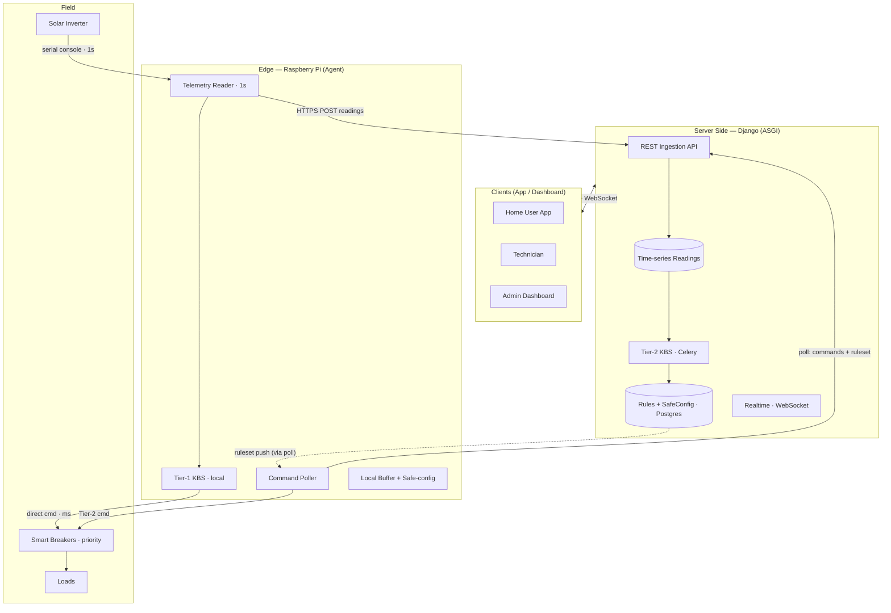
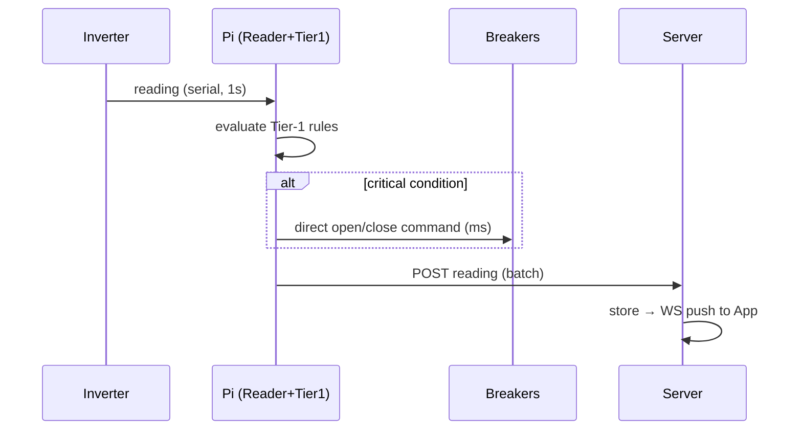
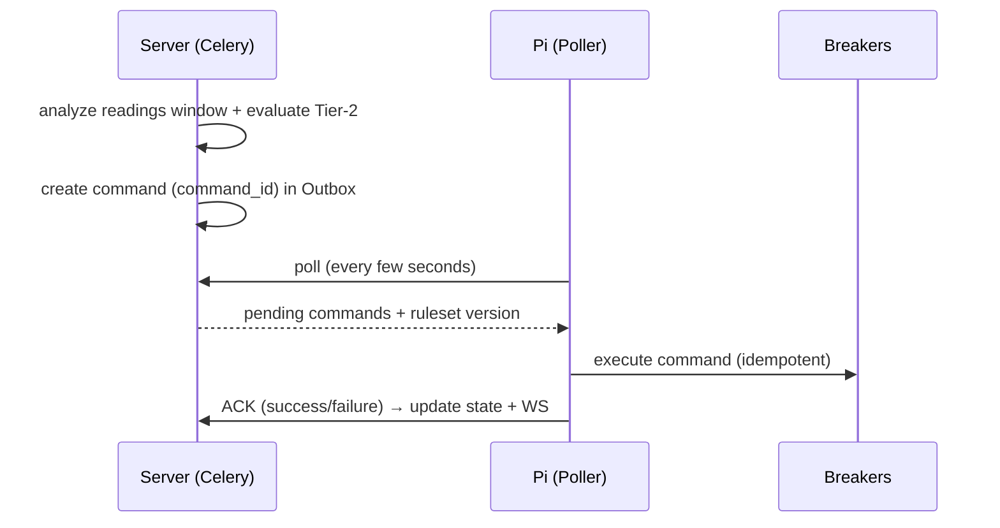
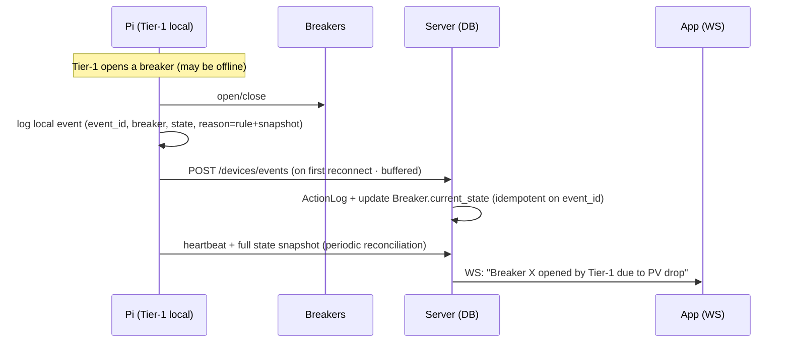

# SmartBreaker — System Architecture Plan

> Architecture plan for discussion only — **no code**. Goal: connect all project components (Inverter → Raspberry Pi → Server → App) in an engineered way that guarantees system stability at every stage.

---

## 1. Context

Goal: keep the solar system running when disturbances occur (a sudden drop in PV production, or an overload), via **smart breakers** controlled by a pre-programmed **KBS** that sheds loads sequentially by priority to reach a "safe zone" that keeps the core running instead of a full collapse.

The logic is split into two tiers:
- **Tier‑1 (seconds level):** very critical situations that cannot tolerate any delay, handled locally on the Raspberry Pi, issuing commands directly to the breakers over the local network — no internet dependency.
- **Tier‑2 (minutes level):** non-critical situations, handled by the Server after analyzing the continuous stream of readings — tolerant of send/receive delay and slow internet.

## 2. Confirmed Decisions (approved by the user)

| Decision | Choice | Architectural Impact |
|---|---|---|
| Transport (Pi ↔ Server) | **HTTPS REST + polling** | The Pi POSTs readings and polls for commands/rules. No MQTT broker needed. |
| Topology | **One site per Organization** | Each `Organization` = one physical site: 1 Pi + 1 Inverter + N breakers. |
| Failsafe | **Revert to a predefined Safe Config** | On connectivity loss/degradation, a predetermined safe breaker configuration is applied deterministically. |
| KBS rules | **Configurable via the app** | Rules and priorities are stored in the DB with versioning and pushed to the Pi via polling. |

## 3. High-Level Architecture (Layered)

## 4. Responsibilities of Each Layer

### 4.1 Edge — Raspberry Pi Agent (local systemd service)
- **Telemetry Reader:** reads the Inverter every second via console/serial, normalizes the reading, passes it to Tier‑1, and buffers it locally.
- **Tier‑1 KBS (local, deterministic):** a lightweight rules engine that evaluates critical situations instantly and issues open/close commands directly to breakers (ms latency). Works **without internet**.
- **Command Poller:** uploads readings (batch/store‑and‑forward) and pulls Tier‑2 commands and the latest ruleset version from the Server, executes them on the breakers, and sends back ACKs.
- **Safe-config guard:** holds a local copy of the Safe Configuration and Tier‑1 rules; applies it deterministically on degradation (details in §7).

### 4.2 Server Side — Django (same current stack)
- **Ingestion API (DRF):** receives readings from the Pi, authenticated via a **per‑device token** (separate from human JWT).
- **Time-series store:** a high-density readings table (recommendation: PostgreSQL + the **TimescaleDB** extension, or a partitioned table + a retention/aggregation policy).
- **Tier‑2 KBS engine (Celery + beat):** periodically analyzes the recent readings window, evaluates Tier‑2 rules, and generates commands in a **Command Outbox** for the Pi to pull.
- **Rules & SafeConfig management:** models + APIs for the admin/technician to author rules and priorities and configure the safe state, with **versioning**.
- **Realtime (Channels/Daphne — already present):** WebSocket to push live status to dashboards.
- **Auth/Notifications:** SimpleJWT for humans (already present) + Celery/email for notifications (already present).

### 4.3 Clients
- App/dashboard for the current roles (`home_user` / `technician` / `admin`): live via WebSocket, historical via REST, and rule management via REST — governed by existing permissions.

## 5. Two-Tier KBS Design

| | Tier‑1 | Tier‑2 |
|---|---|---|
| Location | Raspberry Pi (local) | Server (Celery) |
| Response time | seconds/ms | minutes |
| Inputs | the instantaneous reading | a window of readings + historical context |
| Outputs | direct commands to breakers | commands in an Outbox pulled by the Pi |
| Internet dependency | no | yes (tolerates delay) |
| Rule source | locally stored ruleset (synced) | direct DB |

**Rule representation (logical):** `condition` (thresholds/expression over fields) → `action` (a priority-ordered list of breakers to open/close) + `priority` + `hysteresis/debounce` + `tier`. Shedding is **sequential by priority order** until the safe zone is reached, with hysteresis to prevent flapping.

## 6. Data Flows (Sequence)

**A) Telemetry + Tier‑1 (every second):**

**B) Tier‑2 decision (minutes) + polling:**

**C) Rule sync:** the admin edits a rule → the Server validates it and bumps `ruleset_version` → the Pi compares its version on each poll, and if it differs, pulls the new ruleset and updates the Tier‑1 engine + local Safe Config.

**D) Failsafe:** connectivity loss to the Server → Tier‑2 stops, Tier‑1 keeps running locally with the stored rules, and readings are buffered locally and uploaded on reconnect. On degradation (§7) → the Safe Config is applied deterministically.

**E) Syncing breaker state + shed reason to the DB (Tier‑1 and Tier‑2):**

- **Tier‑2:** the command carries its reason (rule + snapshot) from creation; the ACK updates `current_state` and writes an `ActionLog` immediately.
- **Tier‑1:** local‑first — instant local logging then upload (eventual consistency); the Edge is the source of truth for breaker state during an outage.
- **Principle:** critical shedding never waits on the network; the DB catches up. `event_id` guarantees idempotency, and the periodic snapshot guarantees reconciliation even if an event is lost or state changed via failsafe/manual intervention.

## 7. Safety & Reliability

- **Safe Configuration:** for each site, a predetermined safe breaker configuration (which breakers are ON/OFF to keep the core alive). Stored on the Server **and synced locally** to the Pi.
- **Triggers for reverting to safe state:**
  1. The Pi loses the Server for longer than `T_offline` **and** a situation arises that Tier‑1 cannot guarantee resolving → Safe Config.
  2. A breaker misses the Pi's heartbeat for longer than `T_hb` → the breaker reverts to its safe state (hardware fail‑safe).
  3. Pi boot/restart → starts from Safe Config until sync completes.
  4. Local ruleset staleness beyond `max_age` → Safe Config instead of decisions on outdated rules.
- **Additional patterns:** **idempotent** commands via `command_id`; ACK + retry with backoff; **store‑and‑forward** for readings during outages; bidirectional heartbeat + watchdog; **hysteresis/debounce** to prevent flapping; **audit log** for every breaker action (source + reason + timestamp).

> **Point requiring confirmation:** Tier‑1 keeps operating locally when the internet is lost (the core premise of the project), and the Safe Config is the deterministic fallback only on degradation/uncertainty — it does not replace Tier‑1. Please confirm this interpretation.

## 8. Conceptual Data Model (Conceptual — no code)

| Model | Core Fields | Notes |
|---|---|---|
| `Device` (EdgeController) | organization(1:1), device_token, last_seen, ruleset_version, status | Pi authentication |
| `Inverter` | organization, model, rated_power, specs | 1 per site |
| `Breaker` | organization, name, priority(int), category(essential/non), controllable, current_state, safe_state, last_reported_at | `safe_state` = its state within the Safe Config; `last_reported_at` for state reconciliation |
| `Reading` (time-series) | device, ts, pv_power, load_power, battery_soc, voltage, frequency… | high-density — time-series storage |
| `Rule` / `RuleSet` | organization, tier, condition, action(breakers+order), priority, hysteresis, enabled, version | authorable from the app |
| `SafeConfig` | organization, breaker_states[], version | the failsafe target |
| `Command` / `ActionLog` | device, breaker, action, source(tier1/tier2/manual/failsafe), command_id, event_id, status, resulting_state, reason, rule(FK, nullable), trigger_snapshot, timestamps | idempotency + audit; `reason`/`trigger_snapshot` carry the shed reason, and `event_id` is for uploaded Tier‑1 events |
| `Event` / `Alert` | organization, type, severity, payload, ts | notifications + log |

## 9. Proposed API Surface (logical — no code)

| Category | Consumer | Description |
|---|---|---|
| `POST /devices/readings` | Pi | upload a batch of readings (device token) |
| `GET /devices/commands` | Pi | pull pending commands + ruleset_version |
| `POST /devices/commands/{id}/ack` | Pi | confirm execution of a Tier‑2 command (success/failure + resulting state) |
| `POST /devices/events` | Pi | upload buffered Tier‑1/failsafe events (event_id, breaker, state, reason) — idempotent |
| `POST /devices/state` | Pi | full breaker state snapshot (periodic reconciliation alongside heartbeat) |
| `GET /devices/ruleset` | Pi | pull the latest ruleset + safe config |
| `GET/POST/PATCH /rules`, `/safe-config`, `/breakers` | Admin/Tech | manage rules and priorities |
| `GET /telemetry` + `WS /realtime` | App | historical + live stream |

## 10. Infrastructure & Deployment

- **Edge:** a single Python service on the Pi (systemd) = Reader + Tier‑1 + Poller + Safe‑guard, with local storage (SQLite/file) for the buffer, ruleset, and safe config.
- **Server:** Django (Daphne/ASGI) + Celery worker + Celery beat + Redis + PostgreSQL(+Timescale). Extend the current `docker-compose.yml` (currently only Redis) by adding: postgres, web(daphne), celery‑worker, celery‑beat.
- Current production settings need hardening (SECRET_KEY from env, DEBUG=False, ALLOWED_HOSTS) — out of scope for the architecture but required before deployment.

## 11. Proposed Django Apps (following the current `apps/` structure)

- `apps.devices` — EdgeController/Inverter/Breaker + device authentication.
- `apps.telemetry` — reading ingestion + time-series storage + querying.
- `apps.kbs` — Rules/RuleSet/SafeConfig + Tier‑2 evaluation engine.
- `apps.commands` — Outbox + ACK + ActionLog (idempotency/audit).
- `apps.realtime` — Channels consumers for the live stream.
- (Reuse `apps.accounts` and `apps.organizations` as-is.)

## 12. Phased Roadmap (high level)

1. **Foundation:** `devices`/`breakers` models + device authentication + docker-compose extension (postgres/celery).
2. **Telemetry pipeline:** ingestion API + time-series storage + WebSocket streaming.
3. **KBS Tier‑2:** rule models + evaluation engine on Celery beat + Command Outbox/ACK.
4. **Edge Agent:** Inverter reader + local Tier‑1 + poller + store‑and‑forward.
5. **Failsafe:** SafeConfig + heartbeats + watchdog + deterministic fallback logic.
6. **Rule management + dashboards:** authoring APIs + role-based UIs.

## 13. Verification

- **Inverter simulation:** a mock that streams readings every second (including PV-drop/overload scenarios) to validate the Tier‑1 and Tier‑2 paths without hardware.
- **Failsafe test:** cut the connection to the Server and confirm Tier‑1 keeps running and the Safe Config is applied on degradation, then confirm buffered readings upload on reconnect.
- **Idempotency test:** resending the same `command_id` must not execute the command twice.
- **Unit tests** for the rules engine (priority ordering + hysteresis) on `apps.kbs`.

## 14. Open Questions/Risks for Discussion

- The Inverter's console protocol (Modbus / a proprietary text protocol?) and the breaker control protocol (Modbus / GPIO relays / a smart relay API?).
- Command polling rate (balancing Tier‑2 response time against load).
- Time-series data retention policy (raw vs. aggregated) and storage volume.
- Confirmation of the failsafe interpretation in §7.
