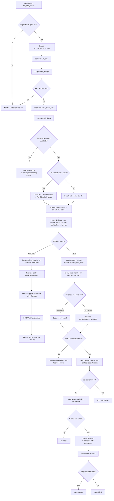
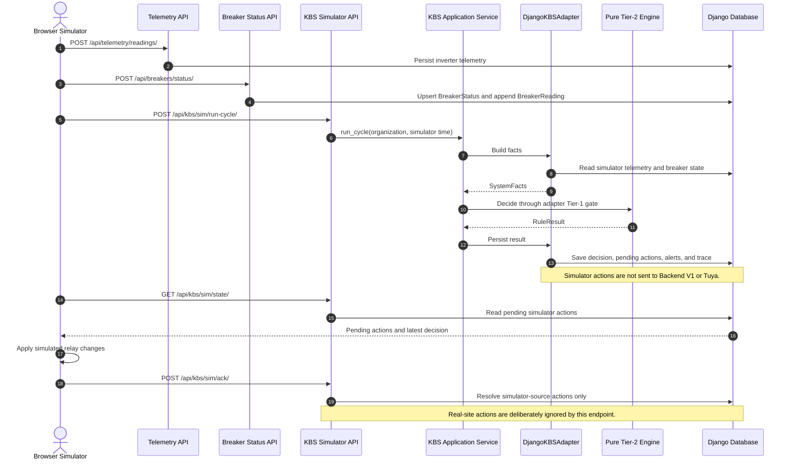
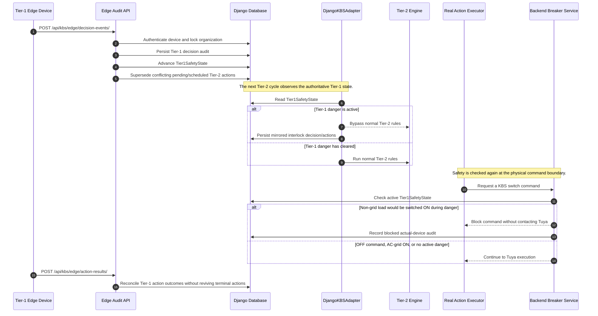
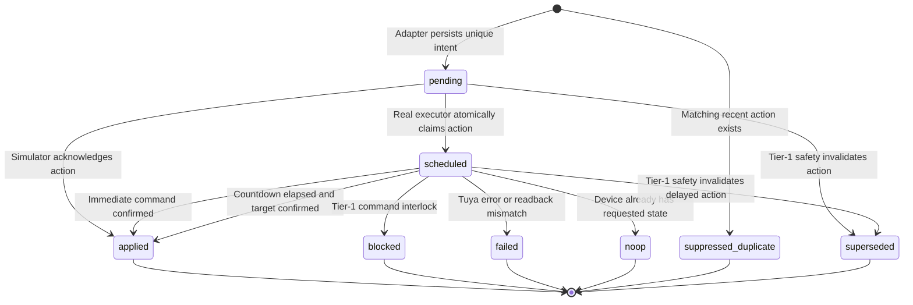

# Backend V1 and KBS Adapter Flow

This document describes the adapter implemented on the `version-1` branch.
It covers the current merged implementation, not the proposed future redesign
that would move breaker state into a separate telemetry repository.

The adapter has two responsibilities:

1. Translate Django/backend data into immutable facts for the Tier-2 KBS.
2. Persist KBS outcomes and route real-site actions through Backend V1's Tuya
   services without allowing the KBS engine to depend on Django or Tuya.

## Component ownership

| Component | Responsibility |
|---|---|
| `apps.kbs.services.run_cycle` | Orchestrates one Tier-2 decision cycle |
| `DjangoKBSAdapter` | Reads Django state, builds facts, applies the Tier-1 gate, and persists results |
| `apps.kbs.engine` | Pure, dependency-free Tier-2 facts and rules |
| `apps.kbs.executor` | Claims committed real-site intents and executes them through Backend V1 |
| `apps.breakers.services` | Tuya command, live readback, Tier-1 command interlock, and actual-device audit |
| `apps.kbs.audit_views` | Receives Tier-1 edge decisions/results and maintains the authoritative safety state |
| `apps.kbs.views` | Simulator cycle, state, acknowledgment, reset, and settings APIs |

## End-to-end flowchart



## Real-site decision and execution sequence

```mermaid
sequenceDiagram
    autonumber
    participant Beat as Celery Beat
    participant Tasks as KBS Celery Tasks
    participant Service as KBS Application Service
    participant Adapter as DjangoKBSAdapter
    participant DB as Django Database
    participant Engine as Pure Tier-2 Engine
    participant ExecTask as KBS Execution Task
    participant Executor as KBS Executor
    participant Backend as Backend Breaker Service
    participant Tuya as Tuya Cloud/Device

    Beat->>Tasks: run_kbs_cycles()
    Tasks->>DB: Find active KBS settings and latest Tier-2 decisions
    DB-->>Tasks: Due organizations
    Tasks->>Tasks: Queue run_kbs_cycle_for_org(org_id)
    Tasks->>Service: run_cycle(organization)

    Service->>Adapter: get_settings(organization)
    Adapter->>DB: Get or create KBSSettings
    DB-->>Adapter: mode, data_source, thresholds, cadence
    Adapter-->>Service: settings

    alt Mode is not active
        Service-->>Tasks: Stop with no decision or action
    else Mode is active
        Service->>Adapter: resolve_cycle_time(...)
        Adapter-->>Service: Server time for real site
        Service->>Adapter: build_facts(...)
        Adapter->>DB: Read inverter telemetry window
        Adapter->>DB: Read breakers, current statuses, history, events, and settings
        DB-->>Adapter: Persistent source data
        Adapter-->>Service: Immutable SystemFacts

        Service->>Adapter: make_decision(facts, Engine.decide)
        Adapter->>DB: Read Tier1SafetyState
        alt Tier-1 safety hold is active
            Adapter-->>Service: Mirrored Tier-1 interlock result
        else No Tier-1 safety hold
            Adapter->>Engine: decide(facts)
            Engine-->>Adapter: RuleResult with trace, actions, and alerts
            Adapter-->>Service: Tier-2 RuleResult
        end

        Service->>Adapter: persist_result(...)
        Adapter->>DB: BEGIN and lock organization row
        Adapter->>DB: Re-read Tier1SafetyState under transaction
        Note over Adapter,DB: The second Tier-1 check closes the race between fact building and persistence.
        Adapter->>DB: Insert KBSDecision and audit trace
        Adapter->>DB: Insert actions, alerts, lockouts, and dedupe outcomes
        Adapter->>DB: COMMIT
        DB-->>Adapter: Committed action IDs

        alt data_source is real and actions were committed
            Adapter->>ExecTask: Queue execute_kbs_action(action_id) after commit
            ExecTask->>Executor: execute_action(action_id)
            Executor->>DB: Lock pending action and verify real data source
            DB-->>Executor: Claimed action; status becomes scheduled

            alt Action has no countdown
                Executor->>Backend: set_switch(breaker, target, source="kbs")
            else Action has countdown
                Executor->>Backend: set_countdown_seconds(..., desired_state=target)
            end

            Backend->>DB: Check active Tier1SafetyState
            alt Unsafe ON while Tier-1 is active
                Backend->>DB: Insert actual-device audit as blocked
                Backend-->>Executor: blocked with safety reason
                Executor->>DB: Mark KBS action blocked
            else Command is permitted
                Backend->>Tuya: Send switch or countdown command
                Backend->>Tuya: Read device properties
                Tuya-->>Backend: Live relay state and countdown
                Backend->>DB: Insert actual-device BreakerAction audit
                Backend-->>Executor: Confirmed or failed result
                Executor->>DB: Mark applied, scheduled, no-op, or failed

                opt Countdown was scheduled
                    ExecTask->>ExecTask: Queue confirm_kbs_action after countdown + 5 seconds
                    ExecTask->>Executor: confirm_action(action_id)
                    Executor->>Backend: read_status(breaker)
                    Backend->>Tuya: Read live properties
                    Tuya-->>Backend: Current relay state
                    Backend-->>Executor: Normalized device state
                    Executor->>DB: Mark applied if target reached; otherwise failed
                end
            end
        else Simulator source or no actionable intents
            Adapter-->>Service: Decision remains available for simulator/state API
        end
    end
```

## Simulator sequence



## Tier-1 safety coordination sequence



## Action state machine



Resolved actions are terminal. Simulator acknowledgments and later edge results
must not change a terminal action back to pending or applied.

## Persistent records

| Record | Purpose |
|---|---|
| `telemetry.Reading` | Inverter, grid, PV, battery, temperature, and site-load history |
| `breakers.BreakerStatus` | Latest persisted breaker state used by the current adapter |
| `breakers.BreakerReading` | Breaker power/switch history used for sudden-draw attribution |
| `kbs.KBSSettings` | Mode, source, cadence, thresholds, capacity, and rule settings |
| `kbs.Tier1SafetyState` | Latest authoritative Tier-1 safety hold |
| `kbs.KBSDecision` | Immutable facts, selected branch, structured trace, and provenance |
| `kbs.BreakerAction` | Intended KBS action and durable lifecycle outcome |
| `breakers.BreakerAction` | Actual Backend V1/Tuya command audit and device readback |
| `kbs.Alert` | KBS alert outcome, including cooldown suppression |

The two action models are intentionally different:

- `kbs.BreakerAction` answers: "What did the KBS intend and what happened to that intent?"
- `breakers.BreakerAction` answers: "What command did Backend V1 actually attempt against the physical device?"

## Safety and consistency guarantees

1. The pure Tier-2 engine imports neither Django nor Backend V1.
2. Actions are queued only after the persistence transaction commits.
3. A row lock prevents two workers from claiming the same real action.
4. Simulator acknowledgments cannot resolve real-site actions.
5. Tier-1 is checked while deciding, while persisting, and again before an
   unsafe physical ON command.
6. OFF commands remain permitted during a Tier-1 danger.
7. AC-grid ON is exempt from the non-grid load interlock.
8. Every real command produces both a KBS intent outcome and an actual-device
   Backend audit.
9. Tuya acceptance alone is insufficient; the backend reads the device state
   back before confirming an immediate command.

## Current operational limitation

Backend V1's Tuya poller currently refreshes Redis only. The current KBS adapter
reads persistent `BreakerStatus` and `BreakerReading` rows, which are populated
through the simulator/Pi status-ingestion endpoint. Therefore, a real site must
continue sending those persistent breaker snapshots, or the poller must be
extended to persist its fresh Tuya reads.

This is the boundary discussed for the future redesign: move persistent breaker
state behind a shared repository so the Tuya poller, Pi, and simulator all write
through one normalized service.

## Implementation map

- [KBS application service](../apps/kbs/services.py)
- [Django KBS adapter](../apps/kbs/adapters/django.py)
- [Real-site KBS executor](../apps/kbs/executor.py)
- [KBS Celery tasks](../apps/kbs/tasks.py)
- [Backend breaker services](../apps/breakers/services.py)
- [Tier-1 audit ingestion](../apps/kbs/audit_views.py)
- [Simulator APIs](../apps/kbs/views.py)
- [Pure KBS facts](../apps/kbs/engine/facts.py)
- [Pure KBS rules](../apps/kbs/engine/rules.py)

## Verification commands

```bash
DJANGO_SETTINGS_MODULE=config.settings.test python manage.py test
python3 -m unittest edge.test_tier1_kbs edge.test_simulator_bridge edge.test_audit
DJANGO_SETTINGS_MODULE=config.settings.test python manage.py check
DJANGO_SETTINGS_MODULE=config.settings.test python manage.py makemigrations --check --dry-run
```
