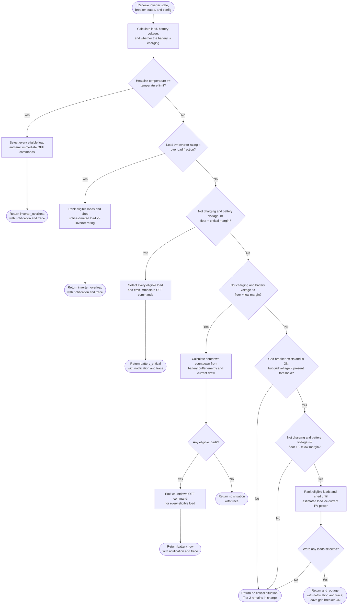
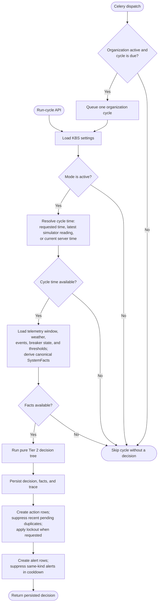
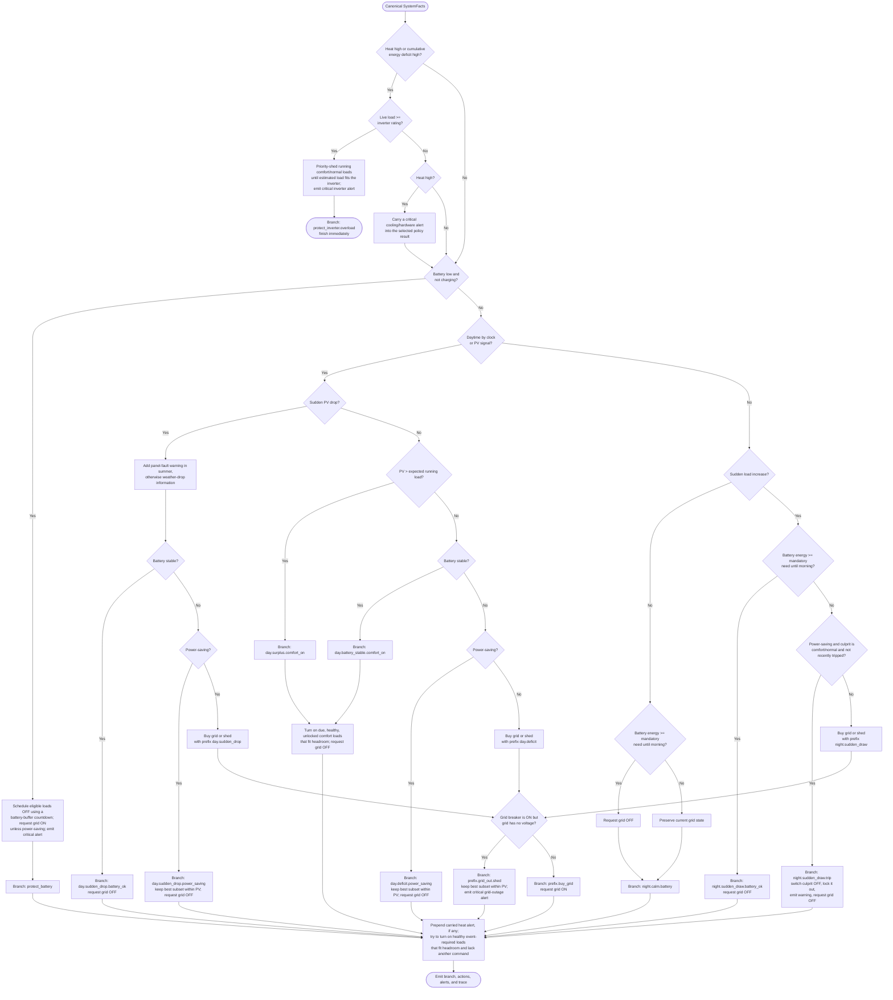

# SmartBreaker KBS: Tier 1 and Tier 2 Flowcharts

These flowcharts document the behavior implemented by the current code. Tier 1 is
the local safety layer and Tier 2 is the server-side policy layer.

## Tier 1: local safety flow

Tier 1 evaluates the current inverter and breaker state in a fixed order. The first
matching safety situation returns immediately, so a rule lower in the chart is not
evaluated after a higher-priority rule fires.

### Tier 1 breaker selection

- A load is eligible for Tier 1 shedding only when it is ON, online, and its
  priority type is `comfort` or `normal`.
- Eligible loads are shed least-important first: category rank ascending
  (`comfort` before `normal`), then priority degree ascending.
- `mandatory` loads and the `ac_grid` breaker are never selected by the Tier 1
  shedding helper.
- Battery-low countdown is clamped to the configured minimum and maximum. It uses
  measured battery draw when available, otherwise `max(load - PV, 0)`.
- The audited edge service stores a new decision only when the active situation or
  command signature changes. It also records clear transitions and evaluator errors
  in local SQLite, then uploads events and action results asynchronously when the
  server is reachable. Decision-making itself does not wait for this upload.

Implementation: [`edge/tier1_kbs.py`](../edge/tier1_kbs.py) and
[`edge/audit.py`](../edge/audit.py).

## Tier 2: server cycle flow

Tier 2 is run for active organizations by Celery or through the run-cycle API. A
cycle can be skipped before the decision engine when there is no usable cycle time
or telemetry.

## Tier 2: decision flow

### Tier 2 selection and output rules

- Normal shedding protects `mandatory` and event-required loads. It ranks eligible
  running `comfort`/`normal` loads outside their usage window first, then by category
  and priority degree from least to most important.
- Best-subset branches first reserve supply for mandatory and event-required loads,
  then greedily keep the most important sheddable loads that fit the remaining power
  budget.
- Comfort and event-required switch-on selection is greedy, most-important first,
  and accounts for motor peak draw during the configured peak period.
- A grid state request becomes a no-op if the grid breaker is absent or already in
  that state. An unhealthy grid breaker blocks an ON command and emits a critical
  breaker-fault alert.
- The inverter-overload branch finishes immediately. All other completed policy
  branches pass through event-required post-processing before the trace is finalized.
- Persistence keeps every decision for audit. Same-breaker, same-action commands that
  are already pending or scheduled within 10 minutes are stored as
  `suppressed_duplicate`; same-kind alerts within 5 minutes are stored as suppressed.

Implementation: [`apps/kbs/tasks.py`](../apps/kbs/tasks.py),
[`apps/kbs/services.py`](../apps/kbs/services.py),
[`apps/kbs/adapters/django.py`](../apps/kbs/adapters/django.py), and
[`apps/kbs/engine/rules.py`](../apps/kbs/engine/rules.py).

