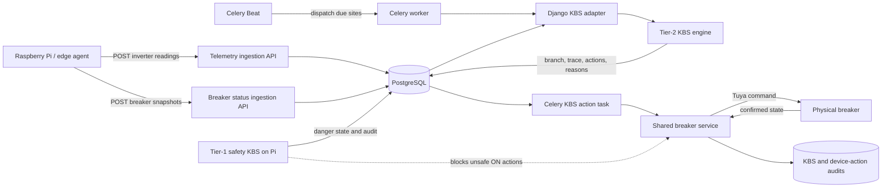

# Running SmartBreaker with the KBS Engine

This guide describes the real-site runtime path from Raspberry Pi readings to a
Tier-2 KBS decision and a physical breaker action. It also explains how to run
the required backend processes and how to verify the complete loop.

## Is the proposed scenario correct?

Yes, with two clarifications:

1. The Raspberry Pi currently **pushes** raw inverter readings and breaker
   snapshots to Django. Celery does not pull readings from the Pi in the current
   codebase. Celery schedules and runs the server-side KBS after the readings
   have been stored.
2. The KBS should not call the backend's own HTTP breaker endpoint. Both REST
   requests and KBS actions should use the shared `apps.breakers.services`
   functions. This preserves Tuya handling, Tier-1 interlocks, confirmation,
   notifications, and audit records in one implementation.

The supported real-site flow is therefore:



## Responsibilities

### Raspberry Pi / edge agent

The edge process should:

- read inverter data, such as the QPIGS stream;
- read or observe the current state of every breaker;
- timestamp all readings in UTC;
- push inverter telemetry to `/api/telemetry/readings/`;
- push breaker snapshots to `/api/breakers/status/`;
- run the dependency-free Tier-1 safety engine locally for hazards that cannot
  wait for the network or Celery;
- execute Tier-1 emergency commands locally when the Pi owns that hardware, and
  report its decisions/results through the authenticated edge audit endpoints.

The repository contains the Tier-1 engine, audit spool, and simulator bridge in
`edge/`, but it does **not** yet contain a production QPIGS reader/uploader
daemon. That edge acquisition loop still needs to be implemented for the real
Pi.

### Django backend

The backend stores raw readings, configuration, decisions, reasons, traces,
intent status, and actual-device command audits. For a real site, it also owns
the current Tuya execution path.

### Celery Beat and Celery workers

Celery Beat invokes `apps.kbs.tasks.run_kbs_cycles` every 60 seconds. The
dispatcher finds `KBSSettings` rows in `active` mode and queues a per-site task
when `cycle_seconds` has elapsed.

A worker then:

1. builds facts from recent `Reading`, `BreakerStatus`, and `BreakerReading`
   rows;
2. derives values such as PV power, energy deficit, load baseline, battery
   stability, grid availability, event requirements, and breaker eligibility;
3. runs the pure Tier-2 engine;
4. persists `KBSDecision`, its trace, alerts, and each action with its reason;
5. after the transaction commits, queues every non-duplicate real-site action;
6. executes the action through `apps.breakers.services`;
7. records whether the action was applied, scheduled, blocked, failed, a no-op,
   or suppressed as a duplicate.

The 60-second dispatcher means automatic cycles are effectively quantized to
one minute even if `cycle_seconds` is configured below 60.

## Real-site prerequisites

Before enabling automatic actions, the database must contain:

- an active organization with correct latitude and longitude;
- one `KBSSettings` row for that organization;
- all physical breakers, with device IDs matching the incoming Pi snapshots;
- one valid Tuya credential for the organization;
- meaningful breaker metadata:
  - `priority_type`: `mandatory`, `normal`, `comfort`, or `ac_grid`;
  - `priority_degree`: relative importance inside the category;
  - `load_type`: `normal` or `motor`;
  - `peak_load_W` and `mean_load_W`;
  - optional `cycle_start` and `cycle_end` usage windows;
- recent inverter telemetry and breaker status snapshots.

Do not enable active mode until breaker IDs, priorities, expected loads, Tuya
credentials, safety thresholds, and the Tier-1 interlock have been verified.

## Environment

Use Python 3.12 or newer and configure at least:

```dotenv
SECRET_KEY=replace-me
DEBUG=True

DB_NAME=smartbreaker
DB_USER=postgres
DB_PASSWORD=replace-me
DB_HOST=127.0.0.1
DB_PORT=5432

CELERY_BROKER_URL=redis://127.0.0.1:6379/0
CELERY_RESULT_BACKEND=redis://127.0.0.1:6379/0
CELERY_TASK_ALWAYS_EAGER=False

# Shared cache used by web and Celery breaker polling.
REDIS_URL=redis://127.0.0.1:6379/1

# Generate once and keep stable. Changing it makes stored Tuya secrets unreadable.
TUYA_FERNET_KEY=replace-with-a-fernet-key
```

Generate a Fernet key with:

```bash
python -c "from cryptography.fernet import Fernet; print(Fernet.generate_key().decode())"
```

## Start the backend manually

The current merged `docker-compose.yml` does not pass `docker compose config`
because the Redis health check and application services are incorrectly
indented. Until that file is corrected, start PostgreSQL and Redis separately
and use the following commands.

Create and activate a virtual environment:

```bash
python3 -m venv .venv
source .venv/bin/activate
pip install -r requirements.txt
```

Prepare Django:

```bash
python manage.py check
python manage.py migrate
python manage.py createsuperuser
```

Run these processes in separate terminals, using the same environment:

```bash
# Terminal 1: API
python manage.py runserver 0.0.0.0:8000

# Terminal 2: KBS cycles, action execution, polling, and email tasks
celery -A config worker -l info

# Terminal 3: periodic KBS dispatcher and database-backed breaker schedules
celery -A config beat -l info
```

All three processes are required for automatic real-site operation. Running
Django without the worker and Beat allows API access but does not create the
closed control loop.

## Configure a real organization

Tuya credentials and breakers can be created through the breaker REST API or
Django admin. Credential creation verifies the Tuya account, and breaker
creation verifies the device ID, so the server must have outbound access to
Tuya.

Set the KBS to real, active operation:

```bash
curl -X PATCH \
  "http://127.0.0.1:8000/api/kbs/settings/?organization=ORG_ID" \
  -H "Content-Type: application/json" \
  -d '{
    "mode": "active",
    "data_source": "real",
    "cycle_seconds": 300
  }'
```

`observing` mode deliberately returns without a decision or action.
`data_source=simulator` persists simulator actions but never dispatches them to
real breakers.

The settings endpoint is currently `AllowAny`; the command above is suitable
only for a protected development network. Add authorization before exposing it
in production.

## Pi ingestion contract

### Inverter telemetry

Send one object or a batch to:

```text
POST /api/telemetry/readings/
```

Example:

```json
{
  "organization": 1,
  "timestamp": "2026-08-08T12:00:00Z",
  "grid_voltage_V": 230.0,
  "ac_output_active_power_W": 1450.0,
  "battery_voltage_V": 25.4,
  "battery_charge_current_A": 3.2,
  "battery_capacity_percent": 68.0,
  "battery_discharge_current_A": 0.0,
  "heatsink_temp_C": 42.0,
  "pv_input_current_A": 8.0,
  "pv_input_voltage_V": 120.0,
  "pv_charging_power_W": 960.0
}
```

### Breaker snapshots

Send an array to:

```text
POST /api/breakers/status/
```

Example:

```json
[
  {
    "device_id": "tuya-device-id-1",
    "timestamp": "2026-08-08T12:00:00Z",
    "switch": true,
    "countdown_1_s": 0,
    "cur_current_mA": 3500,
    "cur_power_mW": 805000,
    "cur_voltage_mV": 230000,
    "fault": "",
    "relay_status": "last",
    "child_lock": false,
    "cycle_time": "",
    "online": true
  }
]
```

Breaker snapshot units are milliamps, milliwatts, and millivolts. Every
`device_id` must already exist in the backend, duplicate device IDs in one batch
are rejected, and replaying the same device/timestamp history row is
idempotent.

For normal operation, post inverter and breaker snapshots every 5–30 seconds.
For `data_source=real`, the KBS uses the current server time and only considers
readings inside its configured baseline/deficit window. Incorrect clocks or
stale timestamps cause the cycle to skip because no usable facts are found.

The existing Celery Tuya poller refreshes dashboard cache entries, but it does
not replace these persisted Pi breaker snapshots used by Tier-2 facts.

## Tier-1 safety on the Pi

Tier-1 should evaluate each fresh edge snapshot locally, without waiting for
the backend. Provision its backend identity once:

```bash
python manage.py provision_edge_device ORG_ID
```

Store the printed token securely on the Pi, then configure the supplied bridge
or the production edge agent:

```bash
export SMARTBREAKER_BACKEND_URL=http://backend-host:8000
export SMARTBREAKER_DEVICE_TOKEN='DEVICE_UUID.SECRET'
python -m edge.simulator_bridge
```

The bridge demonstrates configuration retrieval, deterministic Tier-1
evaluation, local SQLite audit spooling, and authenticated upload of decisions
and action results. A production Pi service still needs to connect the returned
Tier-1 commands to the real relay/breaker driver.

When Tier-1 reports an active danger, Tier-2 mirrors the safety decision and the
shared breaker service prevents unsafe non-grid `ON` commands.

## Verify one complete Tier-2 cycle

First confirm that recent telemetry exists. Then enqueue a cycle manually:

```bash
python manage.py shell
```

```python
from apps.kbs.tasks import run_kbs_cycle_for_org
run_kbs_cycle_for_org.delay(ORG_ID)
```

Watch the Celery worker. A healthy real-site run should show:

1. a persisted decision branch;
2. zero or more actions, each with a human-readable reason;
3. an execution task for each non-duplicate action;
4. a final action status such as `applied`, `scheduled`, `blocked`, `noop`, or
   `failed`;
5. an actual-device audit row with `source=kbs` when a Tuya command is sent.

Inspect decision summaries through the authenticated API:

```bash
curl \
  "http://127.0.0.1:8000/api/kbs/decision-logs/?organization=ORG_ID" \
  -H "Authorization: Bearer ACCESS_TOKEN"
```

Inspect the actual breaker command audit:

```bash
curl \
  "http://127.0.0.1:8000/api/breakers/actions/?organization=ORG_ID&source=kbs" \
  -H "Authorization: Bearer ACCESS_TOKEN"
```

The KBS intent and the actual-device command are intentionally separate audit
records:

- `apps.kbs.models.BreakerAction` records what the KBS decided and why;
- `apps.breakers.models.BreakerAction` records what the backend sent to the
  physical device and whether it was confirmed.

## Common failures

| Symptom | Check |
|---|---|
| No cycles appear | Beat is running, Redis is reachable, and `mode=active`. |
| Cycle is skipped | Recent telemetry exists within the configured time window and timestamps are UTC. |
| Actions remain `pending` | Worker is running and `data_source=real`. |
| Action becomes `blocked` | Inspect the Tier-1 safety state and the action's `failure_reason`. |
| Action becomes `failed` | Verify Tuya credentials, region, device ID, network access, and device availability. |
| Action is `suppressed_duplicate` | A pending/scheduled action for that breaker already exists within the ten-minute deduplication window. |
| Simulator creates actions but nothing switches | Expected: simulator actions are never dispatched to Tuya. |
| Dashboard status changes but KBS facts do not | The Tuya poller updates cache; ensure the Pi also posts persisted breaker snapshots. |

## Production gaps to close

Before deploying this closed loop outside a trusted development network:

1. fix and validate `docker-compose.yml`;
2. implement the production Pi QPIGS/breaker acquisition daemon;
3. authenticate `/api/telemetry/readings/`, `/api/breakers/status/`, KBS settings,
   and manual-cycle endpoints—the ingestion/settings endpoints currently allow
   anonymous access;
4. stop printing full telemetry payloads in production logs;
5. use HTTPS and rotate edge/Tuya credentials safely;
6. decide whether real breaker commands are owned by Tuya or by the Pi.

If the Pi directly controls the physical relays, replace the Tuya-specific
execution behind the KBS executor with a breaker transport adapter or an
authenticated Pi command queue. Do not make the backend call its own REST API;
keep the REST views and KBS executor sharing one service abstraction.

## Related documentation

- `docs/backend-kbs-adapter-sequence.md`
- `docs/kbs-tier1-tier2-flowcharts.md`
- `docs/tier1-tier2-safety-interlock.md`
- `KBS_FACTS_AND_RULES.md`
